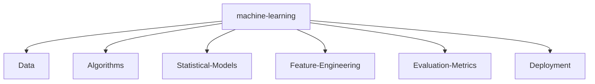

# 👋 Hi, I'm Jaishak

### About Me
- 🎓 Aspiring Software Developer with a keen interest in AI and NLP.  
- 🌟 Dedicated to exploring **Human Nature**, **Science**, and improving **Customer Interaction Solutions** through technology.  
- 💻 Currently working on exciting projects, including **AI-Powered Call Centre Intelligence** and a **Google Gemini-integrated NLP application**.  

---

### 🔧 Technology Stack


            
 

---

<!--   GitHub stats graph -->

### 📈 GitHub Activity Graph:

<!--   green snake -->


<!--   stats + languages -->
                                                                                                                                                | .                                                                                                                              |
|  |

</img>

<!-- dark snake -->


<!--   profile-green-animate -->


<!--   grid-snake  -->

<!--  TOP codersrank для обновления картинки нужно обновить профиль на странице https://profile.codersrank.io/user/idimetrix-->

</img>

<!--  2d history skills для обновления картинки нужно обновить профиль на странице https://profile.codersrank.io/user/idimetrix-->

</img>

<div align="center">
<summary>Trophy: Github Profile Trophy</summary>
</div>

<p align="center"> 
<a href="https://github.com/ryo-ma/github-profile-trophy"></a>
</p>

   <!--machine-learning-->



<!-- KannyaKumari , India - My Home-->


### Profile Views

counting of visitors to this page in this section started from June 12, 2022


</br>

---

<p align="center"><strong>Connect With Us</strong></p>

## 🌐 Socials:
[](https://instagram.com/jaishak.offl) [](https://linkedin.com/in/jaishakj) [](https://medium.com/@jaishak2003) [](https://reddit.com/user/inosuke_09) [](https://twitch.tv/jaishak) [](https://x.com/jaishak_offl) [](https://mastodon.social/@jaishakj) 
</a>
</p>


[//]: # "https://www.asciiart.eu/image-to-ascii"

```

                                  
