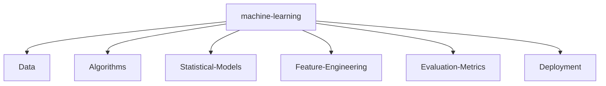

# 👋 Hi, I'm Jaishak

### About Me
- 🎓 Aspiring Software Developer with a keen interest in AI and NLP.  
- 🌟 Dedicated to exploring **Human Nature**, **Science**, and improving **Customer Interaction Solutions** through technology.  
- 💻 Currently working on exciting projects, including **AI-Powered Call Centre Intelligence** and a **Google Gemini-integrated NLP application**.  

---

### 🔧 Technology Stack


---

### 📌 Projects
- **AI-Powered Call Centre Intelligence**: Streamlining customer interactions with real-time insights and automation.  
- **Google Gemini NLP**: Leveraging LangChain and Google Gemini for advanced NLP applications like Q&A chatbots and summarization tools.  
- **GenZTele_bot**: A Telegram bot project hosted on GitHub.  

---

### 💡 Fun Facts
- 👾 Passionate about gaming, especially **Fortnite**.  
- 📺 Anime enthusiast and a cinephile with a love for *How I Met Your Mother* and *Fullmetal Alchemist: Brotherhood*.  
- 🕒 Early riser with a well-structured daily routine.  
- 🧠 INTJ personality and deeply fascinated by **human behavior**.  

---

Feel free to connect and collaborate!  

<!--   GitHub stats graph -->

### 📈 GitHub Activity Graph:

<!--   green snake -->


<!--   stats + languages -->
                                                                                                                                                | .                                                                                                                              |
|  |

</img>

<!-- dark snake -->


<!--   profile-green-animate -->


<!--   grid-snake  -->

<!--  TOP codersrank для обновления картинки нужно обновить профиль на странице https://profile.codersrank.io/user/idimetrix-->

</img>

<!--  2d history skills для обновления картинки нужно обновить профиль на странице https://profile.codersrank.io/user/idimetrix-->

</img>

<div align="center">
<summary>Trophy: Github Profile Trophy</summary>
</div>

<p align="center"> 
<a href="https://github.com/ryo-ma/github-profile-trophy"></a>
</p>

   <!--machine-learning-->




<!-- KannyaKumari , India - My Home-->

```geojson
{
  "type": "FeatureCollection",
  "features": [
    {
      "type": "Feature",
      "id": 1,
      "properties": {
        "ID": 0
      },
      "geometry": {
        "type": "Polygon",
        "coordinates": [
          [
            [
              -74.2591,
              40.4774
            ],
            [
              -73.7004,
              40.9176
            ]
          ]
        ]
      }
    }
  ]
}
```

### Profile Views

counting of visitors to this page in this section started from June 12, 2022


</br>

[MIT](LICENSE)

---

## _If you liked my profile, you can Star ⭐ the repo and if you want to use this template you can Fork it and can use._

Would you ike to meet me?

If you want to contribute to any of my repositories, feel free to submit PRs, issues and email me. Pick a slot if you'd like to meet me and chat about proposals and ideas - but make sure to describe the agenda

---

## _I use an automatic subscription control system. Thus, everyone who subscribes to me, I will subscribe to those and I will respond, and vice versa, I will remove all those who unsubscribe from me from among those who should be followed._

<p align="center">Join our <a href="https://github.com/elevanceit/.github/issues/new?assignees=&labels=invite+me+to+the+organisation&template=invitation.yml&title=Please+invite+me+to+the+GitHub+Organization">GitHub Organization :octocat:</a> and continue to contribute to our Open Source Software ✨</p>


<p align="center"><strong>Connect With Us</strong></p>

<p align="center">
<a href="mailto:jaishak1219@gmail.com"></a>
<a href="https://x.com/Jaishak_offl">

</a>
<a href="https://www.linkedin.com/in/jaishakj/">

</a>
<a href="https://t.me/genzthing">

</a>
</p>

```TypeScript
// Check if the code is functioning correctly

// Let's ensure the code is the epitome of excellence
if (isCodeWorking) {
    console.log("✨ Code works! Time to polish it until it shines.");
    // Perfection is our destination, so onward we go!
    while (codeQuality < perfection) {
        codeQuality++; // Increment the code quality score
        console.log(`Improving... Code quality now at ${codeQuality}.`);
    }
    console.log("🏆 Code has reached perfection!");
}

// The cycle of life: eat, sleep, repeat
while (alive) {
    eat();
    sleep();
    console.log("Repeat! Because life is a loop. 🍕💤🔁");
}

// - Dmitry Selikhov
```

[//]: # "https://www.asciiart.eu/image-to-ascii"

```

| Repository Activity Trends                                                                                                        | Collaborative Productivity - Last 28 days                                                                                                                 |
| --------------------------------------------------------------------------------------------------------------------------------- | --------------------------------------------------------------------------------------------------------------------------------------------------------- |
|  |  |

| Repository Performance Stats - Last 28 days                                                                                          | Active Contributors - Last 28 days                                                                                                                    |
| ------------------------------------------------------------------------------------------------------------------------------------ | ----------------------------------------------------------------------------------------------------------------------------------------------------- |
|  |  |

| Star Geographic Distribution                                                                                                                    | Star History                                                                                                                         |
| ----------------------------------------------------------------------------------------------------------------------------------------------- | ------------------------------------------------------------------------------------------------------------------------------------ |
|  |  |

| Company Affiliation                                                                                                                           | Lines of Code Changes                                                                                                                |
| --------------------------------------------------------------------------------------------------------------------------------------------- | ------------------------------------------------------------------------------------------------------------------------------------ |
|  |  |

| Pull Request Size                                                                                                                                   | Pull Request Lifecycle                                                                                                                             |
| --------------------------------------------------------------------------------------------------------------------------------------------------- | -------------------------------------------------------------------------------------------------------------------------------------------------- |
|  |  |

| Currently Working On - Last 28 days                                                                                                                     | Top Active Contributors - Last 28 Days                                                                                                    |
| ------------------------------------------------------------------------------------------------------------------------------------------------------- | ----------------------------------------------------------------------------------------------------------------------------------------- |
|  |  |

| Repository Annual Ranking                                                                                                                          |
| -------------------------------------------------------------------------------------------------------------------------------------------------- |
|  |
